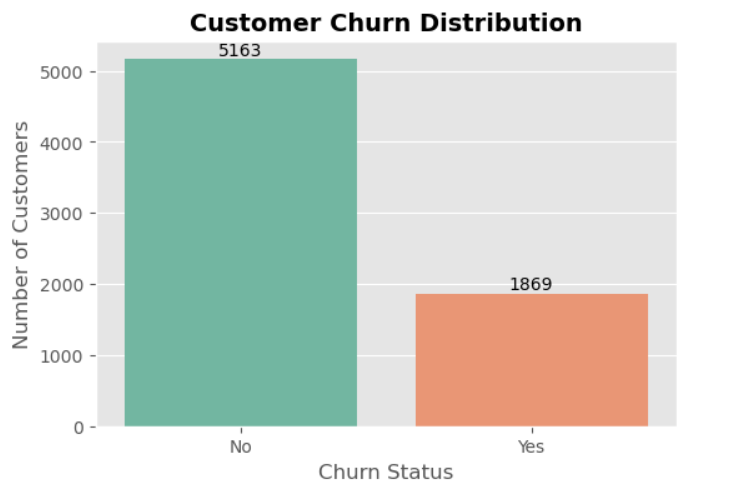
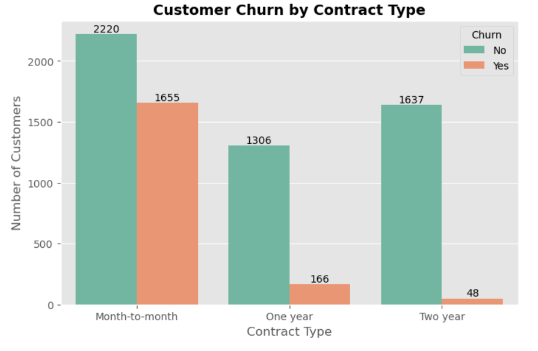
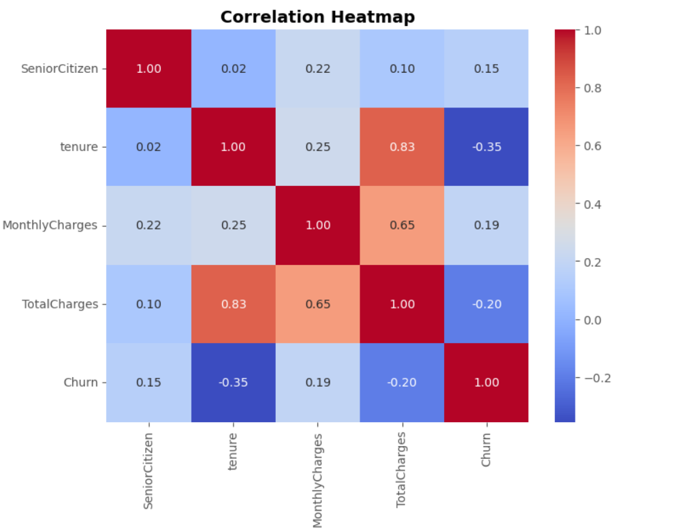
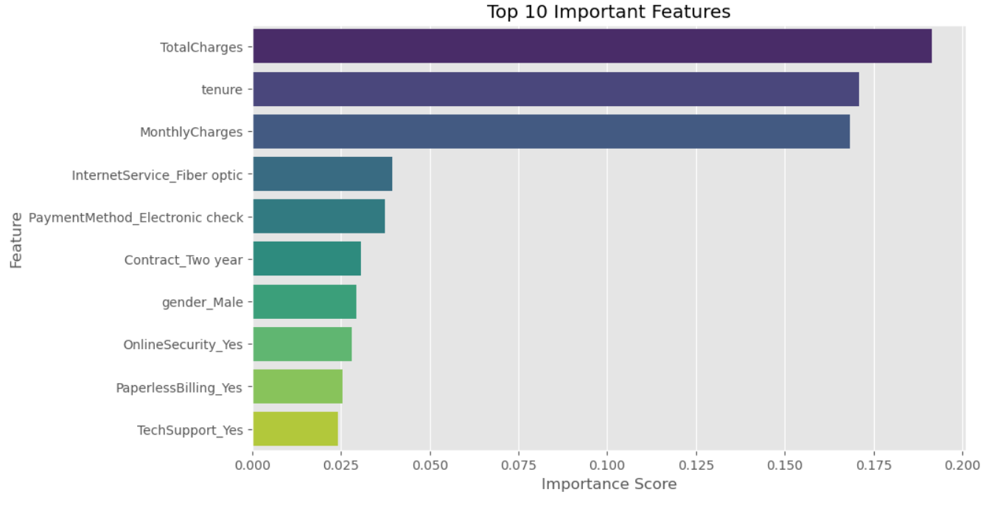
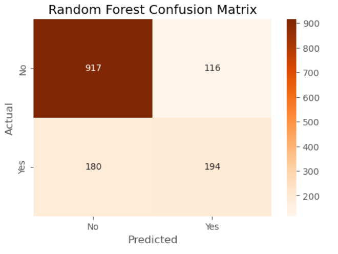

# Customer Churn Prediction using Machine Learning

<p align="center">


</p>

---

## Project Overview

Customer churn is one of the most critical business challenges for subscription-based companies. Identifying customers who are likely to discontinue a service enables businesses to take proactive retention measures and reduce revenue loss.

This project develops an end-to-end Machine Learning pipeline to predict customer churn using the **Telco Customer Churn Dataset**. The workflow includes data cleaning, exploratory data analysis (EDA), feature engineering, model building, model evaluation, feature importance analysis, and business recommendations.

---

## Objectives

- Perform data cleaning and preprocessing
- Analyze customer behaviour using Exploratory Data Analysis (EDA)
- Identify factors associated with customer churn
- Build multiple Machine Learning classification models
- Compare model performance
- Interpret feature importance
- Generate business insights for customer retention

---

## Dataset

**Dataset:** Telco Customer Churn Dataset

The dataset contains customer information including:

- Customer demographics
- Subscription details
- Contract type
- Internet service
- Payment method
- Customer tenure
- Monthly charges
- Total charges
- Churn status (Target Variable)

**Target Variable**

| Value | Description |
|-------|-------------|
| 0 | Customer Stayed |
| 1 | Customer Churned |

---

## Technologies Used

| Category | Tools |
|-----------|------|
| Programming Language | Python |
| Development Environment | Jupyter Notebook |
| Data Analysis | Pandas, NumPy |
| Data Visualization | Matplotlib, Seaborn |
| Machine Learning | Scikit-learn |

---

## Project Workflow

```text
Data Collection
        │
        ▼
Data Cleaning
        │
        ▼
Exploratory Data Analysis
        │
        ▼
Feature Engineering
        │
        ▼
Train-Test Split
        │
        ▼
Logistic Regression
        │
        ▼
Decision Tree
        │
        ▼
Random Forest
        │
        ▼
Model Evaluation
        │
        ▼
Feature Importance
        │
        ▼
Business Insights
```

---

## Exploratory Data Analysis

The following analyses were performed:

- Customer Churn Distribution
- Gender Analysis
- Contract Type Analysis
- Customer Tenure Analysis
- Monthly Charges Analysis
- Internet Service Analysis
- Payment Method Analysis
- Paperless Billing Analysis
- Senior Citizen Analysis
- Correlation Heatmap

---

## Sample Visualizations

### Customer Churn Distribution



---

### Contract Type Analysis



---

### Correlation Heatmap



---

### Feature Importance



---

### Random Forest Confusion Matrix



---

## Data Preprocessing

The following preprocessing techniques were applied:

- Removed unnecessary columns
- Converted `TotalCharges` to numeric format
- Removed missing values
- Applied One-Hot Encoding
- Split the dataset into training and testing sets
- Standardized numerical features for Logistic Regression

---

## Machine Learning Models

The following classification models were implemented and evaluated:

| Model | Purpose |
|--------|----------|
| Logistic Regression | Baseline Classification Model |
| Decision Tree Classifier | Tree-Based Classification |
| Random Forest Classifier | Ensemble Learning |

---

## Model Performance

| Model | Accuracy |
|--------|---------:|
| Logistic Regression | **77.64%** |
| Decision Tree | **76.01%** |
| Random Forest | **79.56%** |

**Best Performing Model:** Random Forest Classifier

---

## Key Findings

- Customers with **month-to-month contracts** had the highest churn rate.
- Customers with **shorter tenure** were significantly more likely to churn.
- Customers with **higher monthly charges** showed a greater likelihood of leaving.
- **Fiber Optic** internet users exhibited higher churn compared to DSL users.
- Customers using **Electronic Check** experienced the highest churn among all payment methods.
- Contract type, tenure, monthly charges, and internet service were identified as the most influential features.

---


## Results

- Performed end-to-end data preprocessing and exploratory data analysis.
- Built three Machine Learning classification models.
- Compared models using Accuracy, Precision, Recall, F1-score, and Confusion Matrix.
- Achieved **79.56% accuracy** using the Random Forest Classifier.
- Identified the key factors contributing to customer churn.
- Generated business recommendations to improve customer retention.

---

## Future Improvements

Potential extensions to this project include:

- Hyperparameter tuning using GridSearchCV
- Cross-validation
- ROC-AUC analysis
- Handling class imbalance using SMOTE
- XGBoost or LightGBM implementation
- Model deployment using Streamlit
- Model serialization using Joblib

---

## Author

**Sarthak Gupta**

B.Tech in Electronics and Communication Engineering  

**Areas of Interest**

- Machine Learning
- Data Analytics
- Artificial Intelligence
- Python

---


